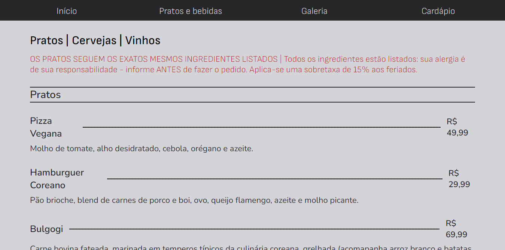

# PROG3-AVAL1

Primeira avaliação de PROG 3
UNIVERSIDADE ESTADUAL DO PIAUÍ – UESPI
CURSO DE BACHARELADO EM COMPUTAÇÃO
DISCIPLINA: PROGRAMAÇÃO III
PROFESSOR: EYDER RIOS

> Zero Fox

O projeto foi feito no intuito de criar uma página estática de um restaurante utilizando HTML e CSS.

utilizamos de inspiração o site: https://www.zerofoxbne.com.au/ de um restaurante já existente para recriar e adaptá-lo, tornando-o responsivo.
